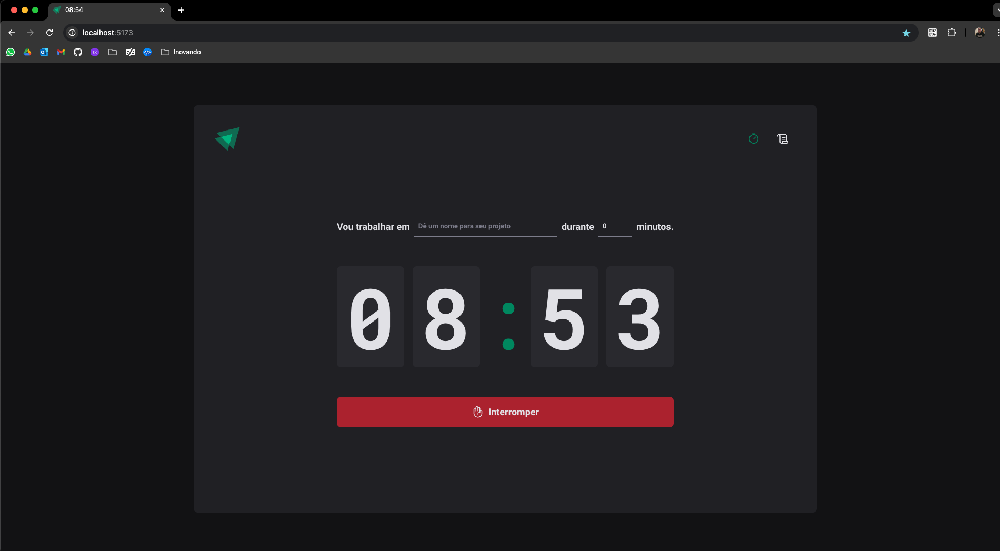

# Ignite Timer Application 
This project is a **Timer application**  developed using **React**, **TypeScript**, and **Vite**. The project is part of the **Rocketseat Ignite course**. In this project, I followed the instructions and coded it while watching the lessons. The goal was to solidify my understanding of modern web development practices and improve my TypeScript skills.

## Features 

- Timer to create a focus session.

- History page to view all the sessions.

## Tech Stack 
 
- **React** : For building the user interface.
 
- **TypeScript** : To ensure type safety and better code maintenance.
 
- **Vite** : A fast and efficient build tool for modern web applications.
 
- **Date-fns** : To handle date formatting and manipulation.

- **React Hook Form** : For managing form state and validation in an easy and scalable way, providing a simple API for forms and better performance.

- **Zod** : For schema-based form validation, ensuring that form inputs adhere to strict data types and rules, enhancing the overall reliability and error handling in the application.

## Live Demo
You can see the live version of this project [here](https://vitor-martini.github.io/ignite-timer).

## Print Screen

